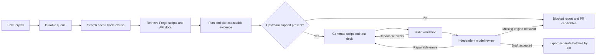

# Forge Astra

An evidence-grounded LangGraph application for discovering Magic: The Gathering
spoilers, researching their Oracle text against upstream Forge card scripts, and
preparing reviewable script batches and eight-copy test decks.

Generated cards are drafts; gameplay testing belongs to a separate harness.
The application never creates upstream commits, pushes, or pull requests. Every
output batch is grouped by set, with a separate draft PR description per set.

The Python application lives in `src/forge_astra`. The optional local `forge-1/`
checkout is ignored by this repository and is used only as a read-only clone seed.

## Run locally

Requires Python 3.11+ and Git. Install [uv](https://docs.astral.sh/uv/), then:

```sh
uv sync --frozen --dev
cp .env.example .env
# Edit .env: choose your endpoint, model, authentication, timezone and Langfuse.
uv run forge-astra sync
uv run forge-astra scan
uv run forge-astra run
# Or poll continuously (default: every six hours).
uv run forge-astra watch
```

`ASTRA_LLM_BASE_URL` accepts a base such as `http://localhost:8000/v1`, a custom
gateway prefix, or the full `/chat/completions` URL. `ASTRA_LLM_MODEL` is the exact
provider model ID. `ASTRA_LLM_API_KEY` is optional for unauthenticated servers;
`OPENAI_API_KEY` also works. The adapter uses minimal Chat Completions requests
without requiring tool calling or native structured output. Set
`ASTRA_LLM_JSON_MODE=true` only if your provider supports JSON mode. Provider
options such as temperature, reasoning settings, and token limits go in
`ASTRA_LLM_EXTRA_BODY`; custom headers go in `ASTRA_LLM_EXTRA_HEADERS`.

Example for LiteLLM:

```dotenv
ASTRA_LLM_BASE_URL=https://your-gateway.example/v1
ASTRA_LLM_MODEL=qwen3.8-27b-pessoa-5090
ASTRA_LLM_API_KEY=your-model-restricted-virtual-key
ASTRA_LLM_EXTRA_BODY={"max_tokens":10000,"temperature":0.1}
LANGFUSE_BASE_URL=https://your-langfuse.example
LANGFUSE_PUBLIC_KEY=pk-lf-...
LANGFUSE_SECRET_KEY=sk-lf-...
```

Use `forge-astra --env-file /private/path/app.env ...` to keep configuration
outside the checkout. Environment variables override the file. No embedding
service, GPU, or cloud-specific agent API is required by the application.

## What counts as a new spoiler

Scryfall has an optional `preview.previewed_at`, but `released_at` is a set's
release date, not its spoiler date. The app polls **all pages** of English paper
cards released in the last 30 days or any future release, then maintains its own
history. `ASTRA_SCRYFALL_QUERY` can restrict this window to particular sets.

On the first scan, cards with today's preview date are queued; other cards seed
a baseline. Later scans queue newly observed cards and Oracle corrections. A
missing preview date is labeled `first_seen`; a known earlier preview is labeled
`late_arrival`. Reports preserve both dates and the discovery reason. This avoids
claiming that first-observed cards necessarily premiered that day. Run regularly
to minimize gaps; Scryfall may lag official previews.

`scan --backfill` deliberately queues the initial snapshot. `import-cards cards.json`
explicitly queues Scryfall card objects, including previously baselined cards.
`retry CARD_KEY` queues a recorded card again. A manual `--day YYYY-MM-DD` chooses
the preview comparison and report date; it does not reconstruct a historical
Scryfall snapshot. An empty or failed scan is never silently treated as a complete
partial page. HTTP errors leave previous history intact.

The queue deduplicates by Oracle ID across printings, tracks content changes,
and persists pending/error/blocked work in SQLite. `run` processes up to
`ASTRA_MAX_CARDS`; `run --drain` and the continuous worker process successive
batches until every eligible card has been attempted once. Failed and blocked
cards wait for the next poll, avoiding immediate retry loops. Each poll refreshes
upstream evidence and discovery once. Only one worker may use a data directory
at a time. Routine runs retry unfinished cards, not already-exported drafts.

During shutdown the worker finishes its current card and leaves the rest queued.
A later process marks abandoned runs interrupted only after acquiring the worker
lock; previously exported results remain available. Health records include the
current phase, activity timestamp, and processed/error counts, so a long batch
can demonstrate progress before the entire poll finishes.

## Research and generation



The core workflow is a real LangGraph `StateGraph` with conditional edges and
bounded revision loops. It searches Oracle phrases on Scryfall, resolves matching
names in Forge's cardsfolder, adds local full-text matches, and retrieves relevant
API documentation. SQLite FTS5 supplies a fast local index without embeddings.
Each report records searches, exact excerpts, source paths, and the pinned
upstream commit. Metadata is assembled from Scryfall rather than model guesses.

The managed sparse checkout always fetches **Card-Forge/forge's default branch**.
It does not trust an unmerged fork. The optional `ASTRA_FORGE_SEED` accelerates
cloning but cannot change the authority. Dirty managed snapshots are rejected.
`run --no-sync` uses a previously verified clean snapshot for deliberate replay;
it does not claim that snapshot is current.

The initial layout support includes ordinary cards, Sagas, Classes, prototype,
level-up, transform, modal double-faced, split, adventure, and flip layouts.
Unknown layouts or incomplete face metadata produce blocked reports. Missing
token dependencies, unrecognized script primitives, malformed metadata, and
unresolved references cannot be exported as accepted draft card files.

### Mechanics and upstream PRs

Every Oracle clause requires an exact executable citation. Keyword names in
Oracle prose, comments, or an engine enum alone are insufficient. Planning and
review must flag new engine behavior, including unnamed interactions. New
combinations of implemented effects are allowed when grounded in working patterns.

For known implementation work, attach an explicit dependency:

```sh
uv run forge-astra track-mechanic "New mechanic" --pr 12345
uv run forge-astra status
```

An explicitly tracked PR must have `merged=true`, a merge timestamp, the correct
upstream default-branch target, and a merge commit included in the pinned
snapshot. A closed unmerged PR or a merge newer than the snapshot remains blocked.
The new implementation also needs executable evidence. Automatically discovered
PR search hits are presented as candidates, not assumed to implement the mechanic.
New upstream examples can establish support without a manually recorded PR.

Static checks and an LLM cannot prove arbitrary novel rules semantics. The gates
reduce unsupported output; drafts still require functional testing. No script is
ever labeled gameplay-tested by this application.

## Output and the external testing harness

Find cards to review or retry without opening the database:

```sh
uv run forge-astra cards --status blocked --set abc
uv run forge-astra cards --status draft --limit 20 --offset 0
uv run forge-astra cards --name "Ember"
uv run forge-astra show CARD_KEY
```

These commands return JSON with card keys, discovery history, attempt counts,
blockers, and latest artifact paths. `show` also includes the source card data.
They do not change queue state or invoke the model.

```text
output/YYYY-MM-DD/RUN_ID/
  manifest.json
  SET_CODE/
    manifest.json
    PR_DRAFT.md
    cardsfolder/a/a_card.txt
    decks/a_card.dck
    test-plans/a_card.md
    reports/a_card-FINGERPRINT.json
```

Each set directory is one potential PR's scope. Reports also cover cards already
upstream, blockers, model/provider errors, and drafts needing review. Only accepted
drafts produce `.txt` card scripts and `.dck` decks; rejected candidates remain in
report JSON. Run directories are immutable across runs, so earlier drafts remain
available for comparison. Treat the latest card status as authoritative when an
Oracle correction supersedes an earlier artifact.

Each deck has eight target copies, 28 selected support cards, and 24 basic lands
distributed across the card's color identity. These are test decks, not legal
tournament decks. Disable `ENFORCE_DECK_LEGALITY` in the separate Forge test profile.
The app does not modify your Forge settings. Check colorless costs, special lands,
partner/meld requirements, and the included test plan when preparing scenarios.

Record what the harness or a human learns:

```sh
uv run forge-astra feedback CARD_KEY \
  'Observed failure: the replacement applied to opponent tokens incorrectly.' \
  --outcome reviewed --retry-card
uv run forge-astra run --no-discover
uv run forge-astra export-knowledge learned.md
```

Knowledge starts with packaged Markdown guidance and accumulates in SQLite.
Model-generated lessons are always `unverified`. Explicit feedback may be
`reviewed` or `rejected`. Learned notes are retrieved during planning and revision;
they never override upstream mechanic gates. Failed/blocked outputs are not
silently promoted into trusted examples.

## Tests and generation benchmarks

```sh
uv run pytest -q
uv run ruff check src tests scripts
uv run forge-astra evaluate --tier 1
uv run forge-astra evaluate --case fatal_push --no-sync
uv run forge-astra evaluate                 # all tiers, real model calls
```

The offline regression suite uses controlled responses to test graph routing,
validation, source authority, persistence, and exports. It does not claim to
measure a real model's scripting quality. The separate live benchmark invokes
your configured endpoint and writes its artifacts under `output/evaluations/`.

| Tier | Cases | Focus |
| --- | --- | --- |
| 1 | Llanowar Elves, Lightning Bolt, Murder, Divination, Giant Growth | One simple effect or mana ability |
| 2 | Fatal Push, Tragic Slip, Wild Slash | Conditions, alternate amounts, conditional extra effects |
| 3 | Jace Beleren, Liliana of the Veil | Multiple abilities, loyalty costs, choices |
| 4 | Bonecrusher Giant, Bala Ged Recovery, Rest in Peace | Linked faces, triggers, replacement effects |
| 5 | Invented Chronoweave card | Unsupported engine behavior must remain blocked |

All inputs have new names and IDs, including renamed self-references on every
face. Original names, expected outputs, and diagnostic checks are not sent as
benchmark instructions. Retrieval of the original as an Oracle analogue is
allowed: learning from existing Forge scripts is the intended workflow. The
`already_upstream` shortcut cannot count as a benchmark pass.

Checks examine executable fields, relationships, targets, amounts, costs, and
ability counts; they ignore field order and exclude Oracle and descriptions.
They **do not require exact script equality**. A different valid implementation
may fall outside a diagnostic pattern and need review. `passed` means static
checks and model review passed, not that Forge execution proved correctness.
Functional validation belongs to the external engine/gameplay harness; Forge
also has headless simulation test infrastructure that such a harness can use.
See [controlled scenarios and acceptance criteria](docs/testing.md) for the
Astra Ember Lance example, harness boundaries, and a recorded live benchmark.
The [verification record](docs/verification.md) maps the requirements to tests,
runtime evidence, and verified live observability.

To test real cards that already have upstream scripts, save a Scryfall JSON
list (or API list response) and run:

```sh
forge-astra evaluate-cards hobbit-sample.json --no-sync
```

This command temporarily withholds every supplied card's script from name,
face, similarity, mechanic-example and keyword-example lookups. Other upstream
cards remain available for research. Exclusions live only in that database
connection; the checkout and persistent index are unchanged. Evaluation history
is separate from the spoiler queue and learned knowledge. Each report records
the withheld paths, and artifacts remain grouped by set. A sample pass means
static validation and model review passed; unlike the built-in benchmarks,
arbitrary samples do not have independent per-card semantic assertions.
See the [Hobbit sample report](docs/hobbit-evaluation.md) for real-model outcomes,
retrieval-exclusion checks, and defects found by source inspection.

For a larger sample, run one batch per set with up to two concurrent workers:

```sh
forge-astra evaluate-sets examples/evaluations/eight-sets-2026-09-05.json --workers 2 --no-sync
```

Every target in the input is withheld from every batch. Each worker owns its
database connections and model history, while one application lock keeps the
upstream snapshot fixed. Card results are saved as they finish; the campaign
summary under `output/campaigns/` is updated after each set. A set-level error
is recorded without preventing the remaining sets from running.

The [80-card, eight-set evaluation](docs/eight-set-evaluation.md) records every
selected card, ten focused rechecks, Langfuse audits, and defects reproduced in
Forge. Its automated draft counts include false passes and require gameplay checks.

For focused rechecks, the Python `evaluate_sets` and `evaluate_cards` functions accept
`holdout_cards=original_sample` separately from the cards being evaluated. Keep the
entire original sample excluded when comparing a smaller recheck with its baseline.

An optional [Forge Java loader check](scripts/forge_probe/README.md) constructs
generated cards and their abilities in the actual engine. Its positive and negative
controls catch a broken harness; successful construction still requires gameplay tests.

## Langfuse

Set both Langfuse keys to enable graph callbacks, per-card spans, model generation
observations, latency/token usage, revision traces, and benchmark scores. Runs use
a shared session ID with `forge-astra`, set, and benchmark-tier tags. Trace content
includes card prompts, source examples, model output, and review results. API keys
and request authorization headers are never included in graph state. Without
keys, the workflow runs with tracing disabled. Flushes occur after runs and during
shutdown. A self-hosted Langfuse 3 server is supported by the pinned v3 SDK.
Card reports also retain model-call timings, token usage, finish reasons, and
schema validation errors locally, including when remote trace ingestion fails.
Use `ASTRA_LANGFUSE_ENABLED=false` to suspend tracing while continuing discovery,
generation, tests, and local diagnostics. Live tracing was re-enabled and verified
on the deployed worker on 2026-09-05. Passing and review-required benchmark runs
both persisted connected graph observations, model inputs/outputs, token usage,
and scores; see the [verification record](docs/verification.md).

## Container and Proxmox

```sh
cp .env.example .env        # configure endpoint/model and Langfuse
docker compose up -d --build
docker compose logs -f worker
docker compose exec worker forge-astra status
docker compose exec worker forge-astra health
```

The image runs as UID 10001, requires no GPU, exposes no inbound port, and uses
persistent volumes for SQLite, the upstream checkout/index, and output. The
Compose service has restart recovery, a health check, bounded logs, and resource
limits. Outbound access is needed to Scryfall, GitHub, your model endpoint, and
Langfuse. Allow time for the initial clone/index and model calls before health is
established. A worker with provider failures is unhealthy rather than silently
reporting success.

On Proxmox, run Compose inside a Docker-capable guest rather than installing the
application into the PVE host OS. Deployment uses the existing guest's SSH alias
and verified host key. To install or update an authorized Docker guest, run
`scripts/deploy.sh SSH_ALIAS /absolute/path/to/private.env`; this pulls `main`,
copies the private configuration, and rebuilds the worker while preserving volumes.
Back up both named volumes; preserve SQLite's WAL files or
use SQLite's online backup API for consistent live backups. Do not use
`docker compose down -v` unless intentionally deleting history and drafts.

## Sources

- [Forge Card scripting API](https://github.com/Card-Forge/forge/wiki/Card-scripting-API)
- [Upstream card scripts](https://github.com/Card-Forge/forge/tree/master/forge-gui/res/cardsfolder)
- [Scryfall API](https://scryfall.com/docs/api) and [card objects](https://scryfall.com/docs/api/cards)
- [LangGraph Graph API](https://docs.langchain.com/oss/python/langgraph/graph-api)
- [OpenAI-compatible Chat Completions](https://developers.openai.com/api/reference/resources/chat/subresources/completions/methods/create)
- [Langfuse LangChain/LangGraph integration](https://langfuse.com/integrations/frameworks/langchain)

Card data and rules text come from Scryfall/Wizards of the Coast. Retrieved Forge
examples retain their upstream provenance and licensing. This is an independent
project, not an official Card-Forge, Scryfall, or Wizards of the Coast service.
